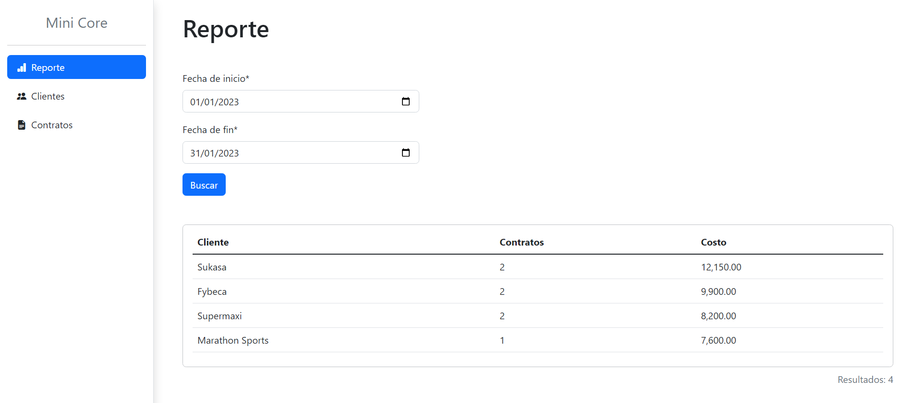

<h1 align="center">Mini Core - Django</h1>
<p align="center"><i>Semestre Pasado</i></p>
<p align="center">
    
</p>




## Description

This project contains a Mini Core implementation created with Django and Python 3.10. The repository also includes some guidelines for deploying the project in Render.

The Mini Core is a web application that manages the clients and the contracts of a company. The main goal of the application is to generate a report of the contracts that are handled by the company for each client in a period of time. The report shows the total amount of contracts as well as the total price of the contracts for each client.

## Getting Started

1. Install Git and Python (using the same version or a higher version than the one used in this project is recommended).
2. Clone the repository (for deploying the project, you can fork it first in your GitHub and then clone it).
3. Install all Python packages:
    ````
    pip install -r requirements.txt
    ````

## Database setup

1. Install PostgreSQL (the version used in this project is 15.0).
2. Create a database called `minicore_db`.
3. Create a `.env` file inside the `web_mini_core` folder and configure the environment variables specified in the `.env.example` file (see the [Environment variables](docs/ENVIRONMENT-VARIABLES.md) guidelines for more information).

> **Note:** Don't forget to activate the virtual environment if you created it, before running the next commands.

4. Open a terminal with administrator privileges in the root of the project and execute the following commands:
    ````
    # Create the tables in the database
    python manage.py migrate

    # Load the initial data
    python manage.py loaddata initial_data
    ````

## Running the project

To run the project, execute the following command:
````
python manage.py runserver
````

## Deploying the project

See the [deployment guidelines](docs/DEPLOYMENT.md) for more information.

