# Deploy the app to Render

- [Deploy the app to Render](#deploy-the-app-to-render)
  - [Getting started](#getting-started)
  - [Setup the database in Render](#setup-the-database-in-render)
    - [Create a Render PostgreSQL database](#create-a-render-postgresql-database)
    - [Get the database connection string](#get-the-database-connection-string)
    - [Connect to the database from pgAdmin (DBMS)](#connect-to-the-database-from-pgadmin-dbms)
    - [Create database tables and add seed data](#create-database-tables-and-add-seed-data)
  - [Setup the app in Render](#setup-the-app-in-render)
    - [Create a Render Web Service](#create-a-render-web-service)
    - [Set the environment variables](#set-the-environment-variables)
    - [Final steps](#final-steps)

## Getting started

1. Create a [Render account](https://render.com/signup).
2. Fork this repository into your own GitHub account.

## Setup the database in Render

### Create a Render PostgreSQL database

Go to the [Render dashboard](https://dashboard.render.com/) and click on the **Create** button, then select **PostgreSQL**.

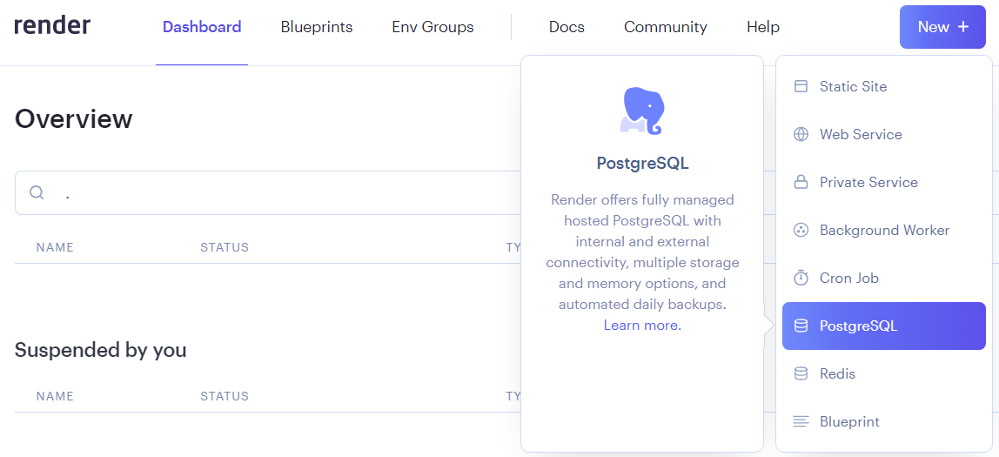

After that, you will be redirected to the database creation page. Here you must set the instance name, the database name and the database user. You can also set the database version, region and plan. For this tutorial, we will use the default values.

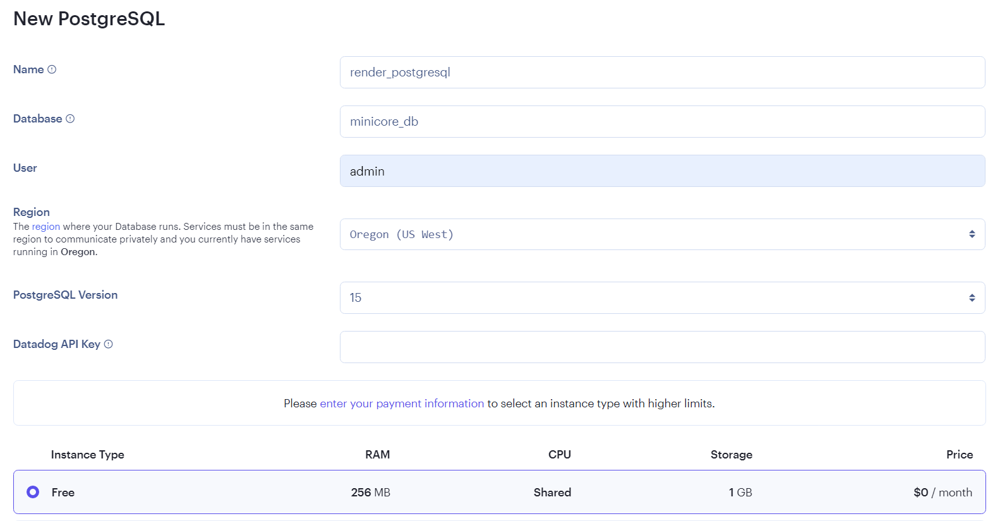

Keep in mind that the database instance type will only be available for 90 days. After that, you will need to create a new database instance or upgrade your plan.

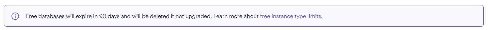

After creating the database, you will be redirected to the database dashboard, where you can see the database information and credentials.

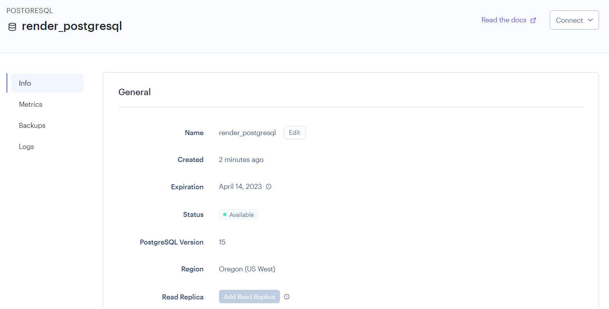

### Get the database connection string

Go to the top right corner of the database dashboard and click on the **Connect** button. Then, go to the **External Connection** tab and copy the **External Database URL** connection string to your clipboard.

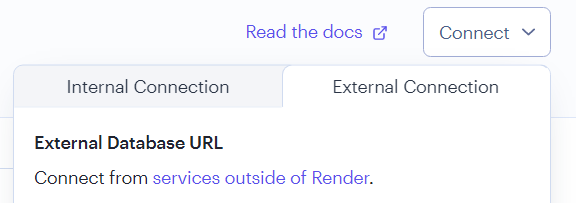

The connection string will have the following format (the port number is not included). This information will be used to connect to the database from the app and pgAdmin.

```
postgres://<username>:<password>@<host>/<database>
```

### Connect to the database from pgAdmin (DBMS)

> *pgAdmin* will be used to interact and manage the database from our local machine. You can download it from [here](https://www.pgadmin.org/download/).

Open pgAdmin, right click on the **Servers** node and select **Register** > **Server...**.

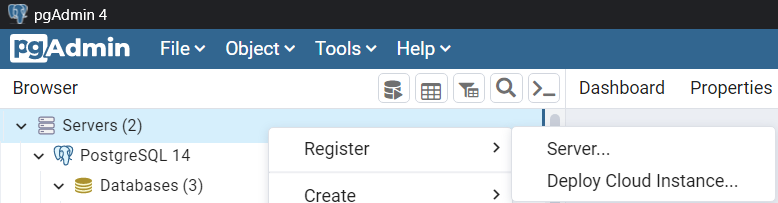

A new window will open for configuring the server connection. In the **General** tab, set the **Name** field (this is the name that will appear in the **Servers** side bar of pgAdmin).

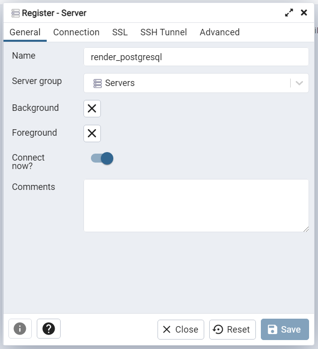

Then, go to the **Connection** tab and set the **Host name/address** field with the host name from the connection string. Also, set the **Username** and **Password** fields with the username and password from the connection string. Keep the default port number (5432).

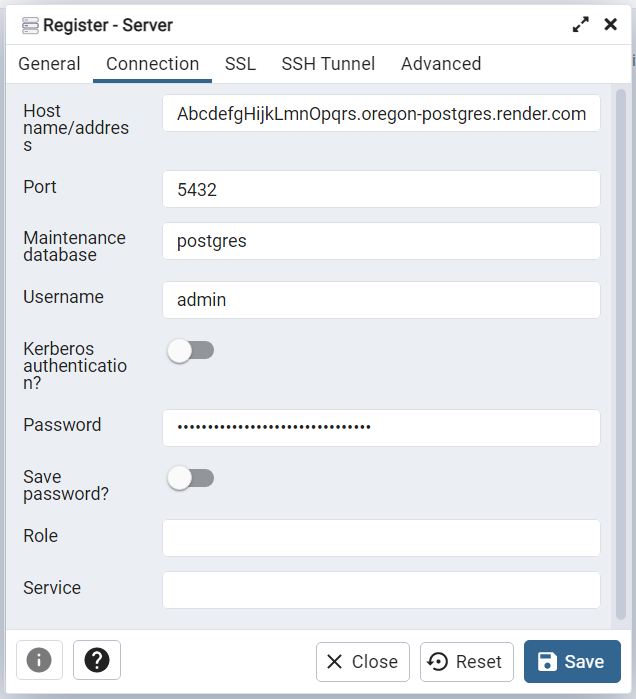

Finally, click on the **Save** button to save the server connection. The server will appear in the **Servers** side bar of pgAdmin.

If you are able to connect to the database, you will see that the database `minicore_db` is already created for you.

> If you are unable to connect to the database, check if your connection credentials are correct and if the database is running in the Render dashboard (the database status should be **Available**).

### Create database tables and add seed data

Before changing the database settings in the `.env` file, I recommend you to create a copy of the file and name it `.env.local` or `.env.development`. This way, you can make changes to the `.env` file and keep the original settings in the `.env.local` file while you set up the production database in Render. This also can be applied to the production settings with a `.env.production` file.

> Files named `.env.local`, `.env.development` or `.env.production` are ignored by Git, so you can safely make changes to them without affecting the repository.

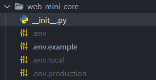

Go to the project in your local machine and change the database settings in the `.env` file inside the `web_mini_core` folder to match the Render database settings (see the [Environment variables](ENVIRONMENT-VARIABLES.md) guidelines for more information).

> **Note:** Don't forget to activate the virtual environment if you created it, before running the next commands.

Open a terminal with administrator privileges in the root of the project and execute the following commands:
````
# Create the tables in the database
python manage.py migrate

# Load the initial data
python manage.py loaddata initial_data
````

## Setup the app in Render

### Create a Render Web Service

Go to the [Render dashboard](https://dashboard.render.com/) and click on the **Create** button, then select **Web Service**.

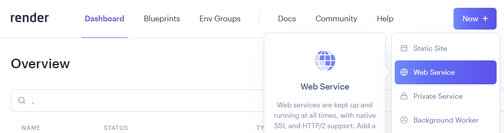

After that, you will be redirected to the web service creation page. Here you must connect the web service to the GitHub repository that contains the app code (forked repository).

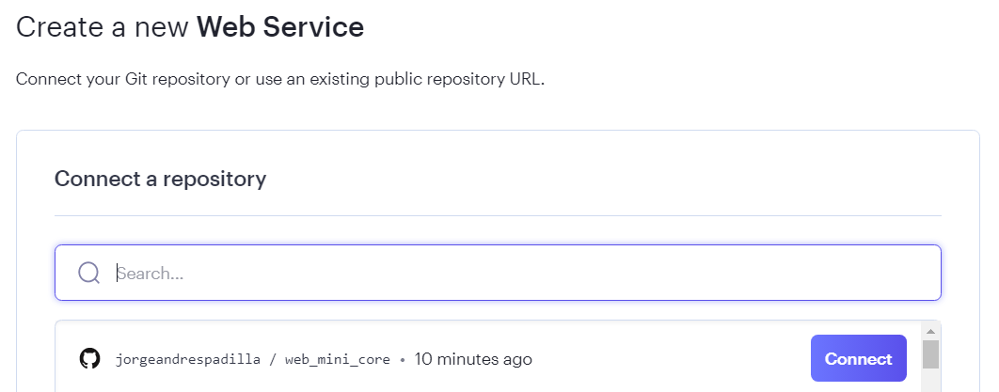

Once the repository is connected, you must set the web service instance name, the branch, the build command and the start command. The execution environment will be automatically detected from your repository (*Python 3*). The other fields will be left with the default values.

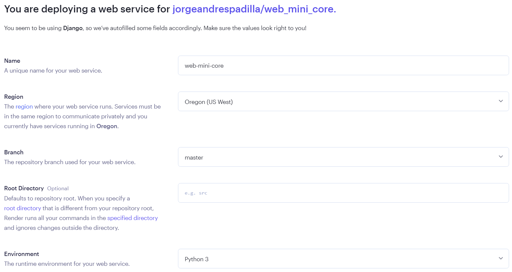

The build command will be used to install the dependencies and set up the static files. The start command will be used to start the web server.

```
# Build command
pip install -r requirements.txt && python manage.py collectstatic

# Start command
gunicorn web_mini_core.wsgi
```

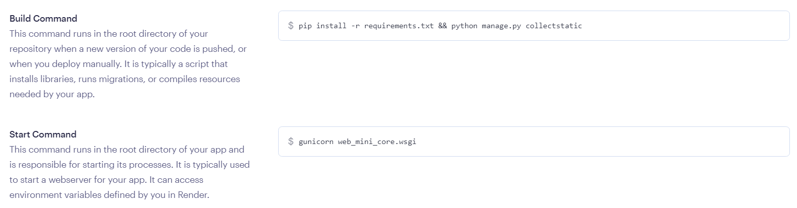

Keep in mind that the free web service instance is scaled down (stopped) when it is not in use. This means that after a period of inactivity, the first request to the web service will take a few seconds to respond. After that, the web service will be scaled up (started) and the response time will be as expected.

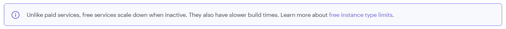

After creating the web service, you will be redirected to the web service dashboard, where you can see the web service information and settings.

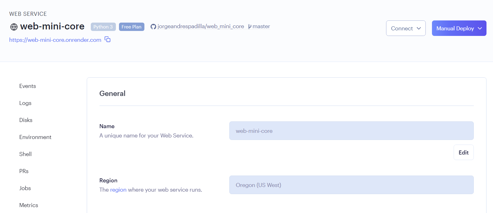

Now, we need to configure the environment variables of the web application (the deployment will probably fail up until this step).

### Set the environment variables

Remember that the environment variables are not included in the repository, so you must set them in the web service settings. Go to the **Environment** tab and add the environment variables from the `.env` file containing the production settings you configured in the previous section.

You must also include an additional environment variable called `PYTHON_VERSION` with the value `3.10.0`, in order to specify the Python version to use in the web service. See [Specifying a Python Version in Render](https://render.com/docs/python-version) for more information.

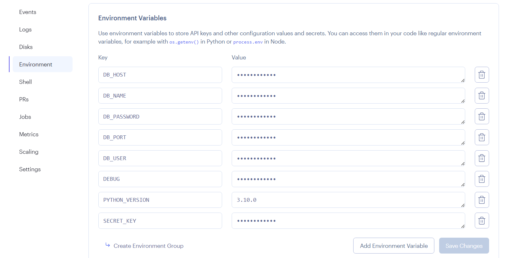

Besides the production database settings, (variables with `DB_` prefix), you must also set a new random value for the `SECRET_KEY` variable, and set the `DEBUG` variable to `False`. See the [Environment variables](ENVIRONMENT-VARIABLES.md) guidelines for more information.

Finally, save the changes made to the environment variables.

> After saving the changes, you will need to wait a few minutes for the web service to be deployed and ready to use. Because of the free plan, the deployment may take longer than usual. You can check the status of the web service in the main dashboard. 

If you have any problems with the deployment, you can go to the **Events** tab, click on a deployment event and check the logs for more information.

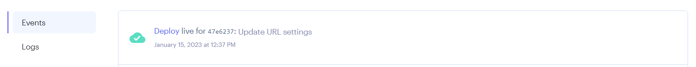

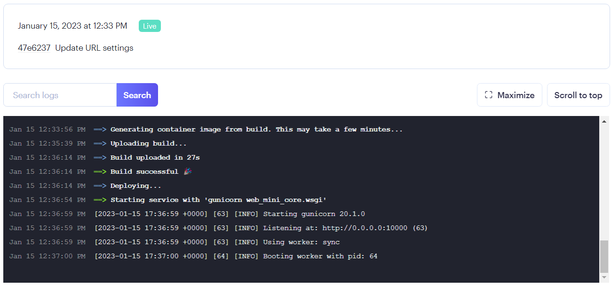

### Final steps

Now, you can go to the URL of the web service to see the app running in production.

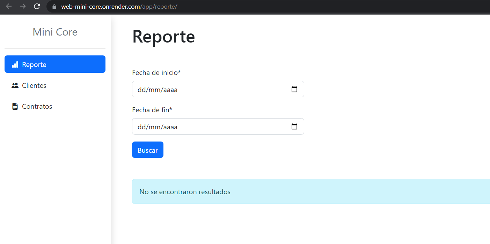
